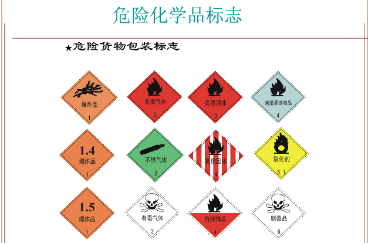
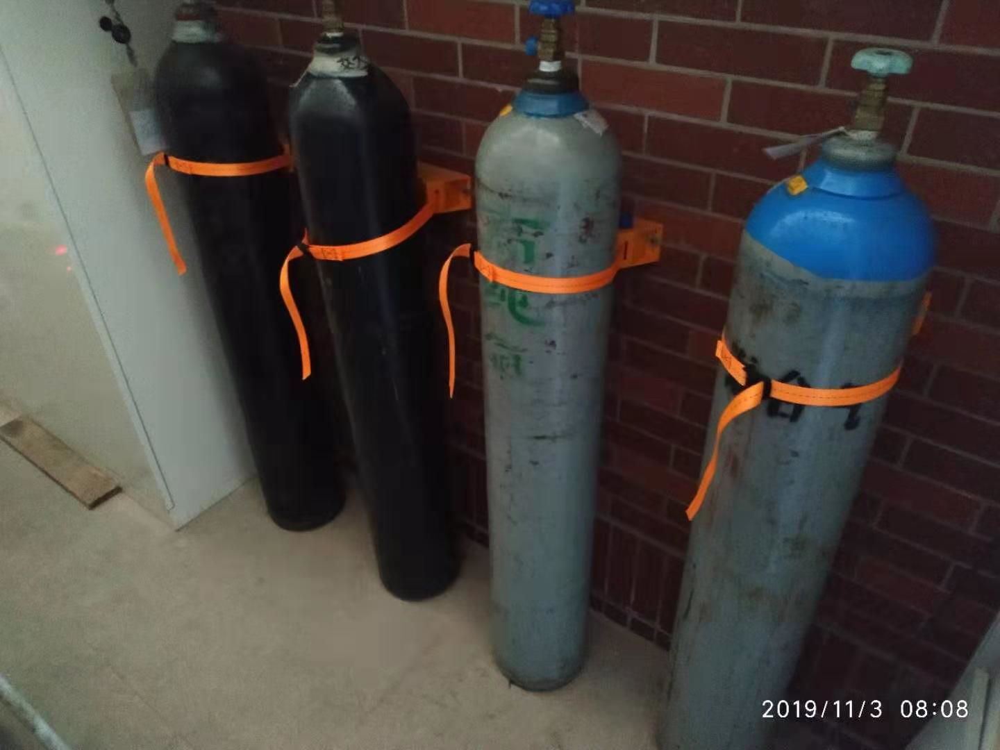
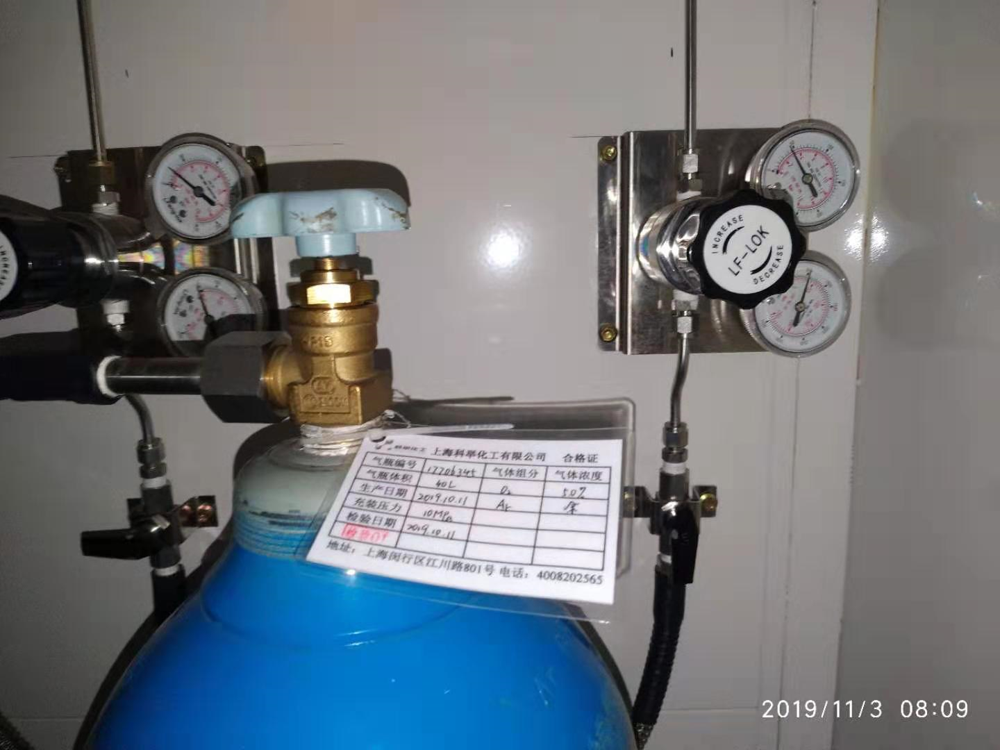
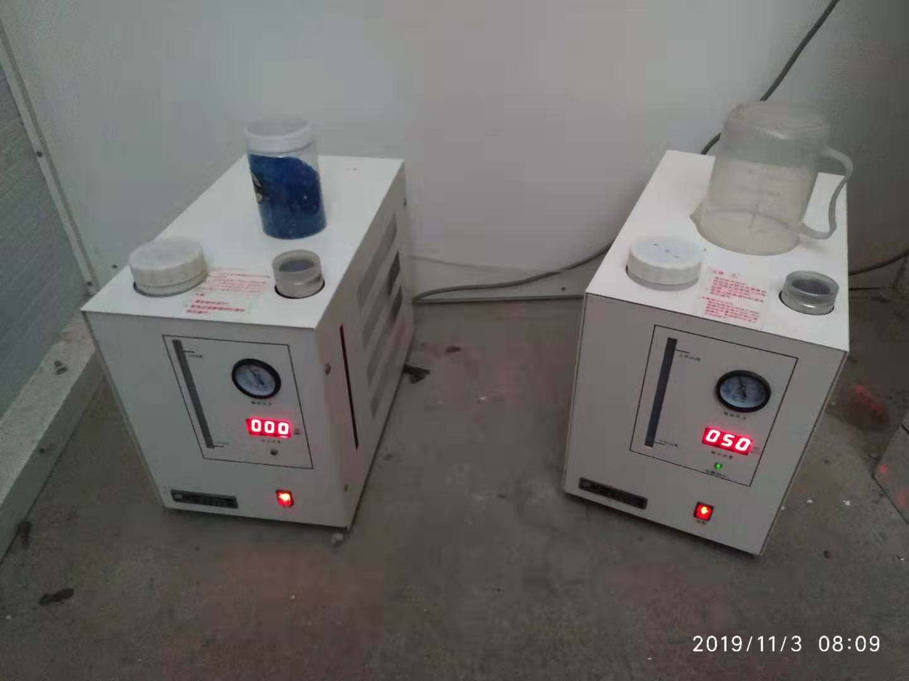

@autoheaders:1.2.3.4.5.6

!> 实验室安全管理是实验室顺利运行的重要基础。安全管理的效果需要依赖以下要点实现：
- **制度上：**完善的安全责任制度和管理办法
- **人员上：**全面的知识储备和人员培训
- **物质上：**充足的防护、安全装置准备

## 化学品使用及安全管理

### 危化品分类

根据我们的日常使用，可以将化学品分为以下几类：

- 固体、液体、气体（高压气瓶）
- 有机物、无机物
- 另外还会对药品特性进行标识：强腐蚀性、剧毒品、易燃品、刺激性气味、易挥发等几类特征。
- 药品的特征都在药品包装上进行了明确标识，请在存储和使用前认真阅读并做好相应防护措施。

### 化学品、气体管理的基本原则【非官方】

- 在使用、存储药品前务必仔细阅读并了解药品特性、学习相关的操作规范、做好防护措施；
- 化学品应根据特性分类存储：易燃易爆药品、强腐蚀性药品、剧毒药品、高压气体等，实验室分别设置了相应的存储柜进行存储；
- 配置药剂过程中务必带好手套、口罩等个人防护用具，称量固体粉末颗粒应当使用药品天平（切勿使用试样专用天平），称量溶液应当使用玻璃量筒（氢氟酸使用一次性吸管或注射器），操作应当符合化学品操作、试验规范；
- 使用后的药品务必及时密封放回药品柜，试验台、天平、称量用具、玻璃器皿等应当进行及时的清洁；
- 化学试验后的废液，若为强酸、强碱、有机溶剂、有毒或腐蚀性溶液，则不应直接排出，应分类放入废液暂存柜中，并标识废液的种类、时间、体积等信息（该标签纸在药品柜旁的信箱中存放）；
- 其他安全防护措施请参见安全教育网站中的学习资源 http://safexam.sjtu.edu.cn

### 化学品称量
- 药品配置和常压溶液实验请务必在通风橱内进行，天平使用后及时关机；
- 称量用具统一存储在天平所在橱柜下方抽屉中，使用后清洁并归位；
- 称量纸一般可称量5g以下药品，大剂量药品请配合烧杯、培养皿进行称量；
-  非特殊情况，请勿使用高精度天平称量药品；
-   称量试样请使用高精度五位天平，且使用碳素镊子、塑料镊子或缠绕生料带的金属镊子，防止对试样表面的损伤；
-   氢氟酸进制使用塑料器皿存放（氢氟酸对玻璃腐蚀），浓碱禁止使用玻璃器皿长期存放（玻璃水）；
-   实验室内有大量的实验器皿和装置，在实验前请务必清楚试验流程，选用适合的装置。

## 高压气瓶的安全管理
### 气瓶及气体识别

实验室使用的高压气体一般为10~15MPa的高压气瓶，目前使用的气体包括：
- 高纯氩气（灰底绿字）
- 高纯氮气（黑底白字）
- 氧氩混合气（5%O2，灰底白字加蓝顶）
- 高纯二氧化碳（灰底黑字）
- 氢气（使用氢气发生器无气瓶）
- 等。

### 气瓶的安装

气瓶需要安放在供气柜里面，连接方式如下图所示，图中右上角的装置为减压阀，下表表示气瓶内残余气体压力，上表表示输出压力。气瓶需要定期检查残余压力与供气压力，并进行记录。若压力过低供气不足，还需要及时采购和更换。

### 氢气发生器

其中氢气的供给方式为使用氢气发生器，通过电解水产生氢气。需要经常观察水位线，向其中加入纯水（若清洗后重新加水，还需要添加氢氧化钾作为电解质），从侧面观察硅胶颗粒是否变为红色（已吸水），若变色需要更换为干燥后的硅胶颗粒（蓝）。

### 二氧化碳气瓶（超临界二氧化碳专用）

此类气瓶为超临界二氧化碳实验环境专用气瓶，该气瓶出口的二氧化碳为液态，配合液体增压泵实现高压釜内的高压二氧化碳环境。

目前二氧化碳气瓶为气体瓶，专设在设备旁边，并使用专用倒置架进行安装，需要专人定期检查，请勿随意触碰。

## 高温高压装置基本规范

高温高压装置包括：高压釜、高压试验回路、加热炉等设备，这些设备在实验室十分常见，也是实验室的主要试验容器，因此这一部分的安全规范十分重要，请务必在操作前仔细阅读并学习相关的规范。  高温装置在运行过程中需要在外侧加装隔热层或保温棉，特别是当其为高温高压容器时，请务必注意一设备的工质进出口、管路等。

!> **高温高压设备禁止新手独自操作！！！**

### 高压釜及管路

- 高压釜的详细结构可以参见测试系统部分的介绍；
- 高压釜一般运行温度在250℃以上，内衬钛合金可以达到350℃，不锈钢一般可以到达400℃，镍基合金可以达到700℃，同样管路材料也适用于上述温度标准；
- 高压釜压力系统根据需求最高压力可以达到25MPa，通过釜体密封圈、卡套、拉伸杆密封圈、电气贯穿件密封圈等进行密封，压力由高压泵提供；
- 高压系统必须安装压力表，高压釜系统上至少应有一套压力传感器及两套指针压力表，同时传感器应当具有超压报警功能，及时关停高压泵；
- 高压系统应当具有安全阀，其功能为超压时排出回路中的工质，安全阀在使用前必须经过调节和测试；
- 高压系统启动前必须检查所有的阀门处于正确挡位、管路中未发生堵塞，同时需要校准回路上的压力表及压力传感器；
- 检查高压釜上下均无易燃物品，禁止将纸质、塑料的储物盒放置在拉伸机、高压釜的上方或下方，且需要检查加热线圈和保温套是否松动；（实验室曾发生失火事故）
- 高压系统必须经过试运行，首先逐步升压检查泄漏点，其次进行保压测试，测试前确保卡套接管拧紧，防止弹射伤人；
- 运行过程中的高温高压系统请张贴“高温”“小心烫伤”等标识，最好能够有充足的实体防护；严禁高压状态下直接开启排水、排气阀门，禁止运行过程中调节安全阀；其他使用规范请参见“标准系统-高压釜系统”。

### 具有加热功能的仪器

- 具有加热功能的仪器包括：热电偶标定炉、热风枪、加热式磁力搅拌器、电烙铁等；
-  这部分设备基本为开放式、半开放式的加热统，与空气存在较强的热交换，且使用过程中缺少防护，因此在操作上述设备的过程中请务必带好手套，严禁直接触摸加热表面或加热出口；
-  设备使用完毕后请务必充分冷却后再进行归位，具有温度监测功能的设备请保持温度监测直到降温至60℃；
-  上述设备禁止在无人值守的情况下长时间开机；
-  使用过程中请保证设备周围无易燃易爆物品，使用者做好充分的防护措施。

### 高压低温设备
- 包括高压气瓶、空气压缩机、气体增压泵等装置；
- 高压气瓶的安全规范请参照“气瓶管理与使用”；
- 空气压缩机使用时严禁气体出口对人；
- 高压容器严禁振动，切勿轻易打开阀门。

## 带电机械工具安全规范

### 常见带电旋转机械装置
(此部分不包括实验室中的标准试验装置及回路)

实验室中常用的带电旋转机械装置包括：切割机、钻床、角磨机、手持电钻等，此类装置一般为高速旋转装置，容易出现机械伤人事故。
- 使用上述设备请务必带好手套，有必要时穿戴实验服、带好护目镜或防护面罩；
- 针对小型样件的加工禁止手持样品，请务必在台钳或切割机夹具上加持试样；
- 一般加工后的样品会有高温残余，禁止徒手直接触摸刚刚加工好的样品；
- 使用后，装置务必断电，并整理电缆归位。

### 其他操作注意事项
- 在实验室使用工具进行设备的组装、高压釜的紧固等操作时，务必穿戴手套，防止机械伤人；
- 电路连接、维护过程中，禁止带电操作，且务做好绝缘操作防止电容放电导致的触电事故；
- 使用加力杆拧紧螺栓的时候，务必对称拧紧，且注意操作范围内无其他高温、带电、易碎、尖锐物品，防止对人员造成损伤；
- 部分设备具有专用夹具、工具，设备专用夹具和工具需贴好标签并统一保存（例如在相应的设备机柜），禁止与通用工具混用；
- 通用工具使用后务必归位，防止丢失，便于其他人使用。

