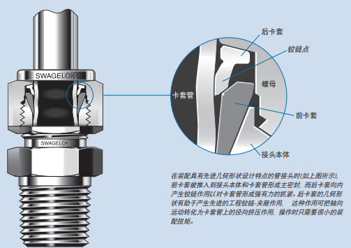

!> 高压釜作为测试发生的核心区域，是服役条件最为恶劣、安全风险最高的区域。工质泄露、工质喷发、管道零配件弹出等，都可能导致人员受伤，因此高压釜等容器和配套的管道阀门的正确使用和维保十分重要。

## 基本概述
首先，按照理论来讲，常用的高压釜并不能算是压力容器，但也很接近了。所以设计、建造、使用的过程中，也要注意相关的安全风险。

其次，整个测试系统的工质是相连的，也是分区的。高温高压区的危险系数最高，所用的基本都是金属容器或管道，其安装和使用需要格外小心。低压区往往也是低温区，主要是装配了各类探头。两个区域都应当格外注意：
- 停机和运行时阀门的通断状态，避免出现堵塞、死管、泄露、死管等情况；
- 容器、管道、阀门、测量等都有其许用的温度、压力、流量和工质范围，所以在安装、维护、更换之前都要注意；
- 禁止带高压条件下开展快速排水（气）、拆装部件的操作。

## 容器与管道
### 高压釜
- 材料
- 分体
- 法兰
- 焊接

### 管道
- 材料
- 管径
- 折弯
-

## 连接与密封

### 高温密封圈到片：平面、弧面与水线
【三种密封结构截面图】

### 卡套管接头：管道连接方案
常规的管道连接方式即使用这类卡套接头，连接：管道-管道、管道-阀门、管道-容器。目前使用的绝大多数管道的连接都是基于这种接头实现的。

根据 **[Swagelok](https://products.swagelok.com.cn/)** 的产品说明（ **[PDF文件](附203Swagelok.pdf)** ），不同材质、不同管径的卡套接头都有其许用的温度和压力上限。在实际使用过程中，请务必注意相关的操作要求。

### 锥螺纹密封
锥螺纹密封在多个压力传感器及低温且中低压力的条件下的连接场景中使用。依靠螺纹锥度、螺纹间生料带实现密封。

其具体使用方法同样可以参考**Swagelok**产品说明。

此处仅简单罗列一些要点：
- 锥螺纹密封最好选用同厂原装配对，以免出现深度不统一的情况；
- 生料带按照旋紧方向缠绕，且不宜过厚，一般三到五层即可；
- 锥螺纹容易和直螺纹弄混，特别是母头，所以务必要检查后再拧紧，切勿再阻力较大时盲目加力。

### 动密封结构
动密封即四氟弹簧密封圈，主要用于拉伸杆的密封。

### 焊接

## 阀
### 球阀与针阀

### 背压与减压

### 单向阀

### 过滤器

## 压力监测
压力监测通过压力传感实现。
### 指针式压力表
- 压力范围：
- 含油/无油：
- 维护：

### 电子式压力传感器

### 安全装置：泄压与爆破

## 专题讲解：压力平衡装置

## 风险情况及处理原则
